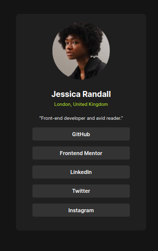

# Frontend Mentor - Social links profile solution

This is a solution to the [Social links profile challenge on Frontend Mentor](https://www.frontendmentor.io/challenges/social-links-profile-UG32l9m6dQ). Frontend Mentor challenges help you improve your coding skills by building realistic projects. 

## Table of contents

- [The challenge](#the-challenge)
- [Screenshot](#screenshot)
- [Links](#links)
- [Built with](#built-with)
- [Author](#author)

## Overview

## The challenge
Users should be able to:

- View the optimal layout depending on their device's screen size

### Screenshot

-Different views:

### Links

- Live Site URL: [Github Pages](https://paresh2421.github.io/social-links/)

## My process

### Built with

- Semantic HTML5 markup
- CSS
- Flexbox

## Author

- Github - [Paresh Nair](https://github.com/paresh2421)
- Frontend Mentor - [Paresh2421](https://www.frontendmentor.io/profile/Paresh2421)
- LinkedIn - [Paresh Nair](https://www.linkedin.com/in/paresh-nair-1987b4254)